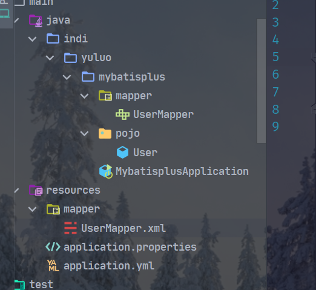
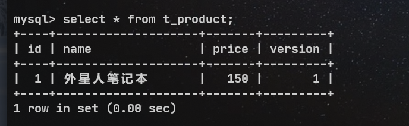
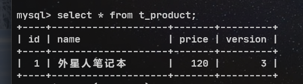

# mybatisplus

## 特性

- **无侵入**：只做增强不做改变，引入它不会对现有工程产生影响，如丝般顺滑
- **损耗小**：启动即会自动注入基本 CURD，性能基本无损耗，直接面向对象操作
- **强大的 CRUD 操作**：内置通用 Mapper、通用 Service，仅仅通过少量配置即可实现单表大部分 CRUD 操作，更有强大的条件构造器，满足各类使用需求
- **支持 Lambda 形式调用**：通过 Lambda 表达式，方便的编写各类查询条件，无需再担心字段写错
- **支持主键自动生成**：支持多达 4 种主键策略（内含分布式唯一 ID 生成器 - Sequence），可自由配置，完美解决主键问题
- **支持 ActiveRecord 模式**：支持 ActiveRecord 形式调用，实体类只需继承 Model 类即可进行强大的 CRUD 操作
- **支持自定义全局通用操作**：支持全局通用方法注入（ Write once, use anywhere ）
- **内置代码生成器**：采用代码或者 Maven 插件可快速生成 Mapper 、 Model 、 Service 、 Controller 层代码，支持模板引擎，更有超多自定义配置等您来使用
- **内置分页插件**：基于 MyBatis 物理分页，开发者无需关心具体操作，配置好插件之后，写分页等同于普通 List 查询
- **分页插件支持多种数据库**：支持 MySQL、MariaDB、Oracle、DB2、H2、HSQL、SQLite、Postgre、SQLServer 等多种数据库
- **内置性能分析插件**：可输出 SQL 语句以及其执行时间，建议开发测试时启用该功能，能快速揪出慢查询
- **内置全局拦截插件**：提供全表 delete 、 update 操作智能分析阻断，也可自定义拦截规则，预防误操作

## 支持数据库

> 任何能使用 `MyBatis` 进行 CRUD, 并且支持标准 SQL 的数据库，具体支持情况如下，如果不在下列表查看分页部分教程 PR 您的支持。

- MySQL，Oracle，DB2，H2，HSQL，SQLite，PostgreSQL，SQLServer，Phoenix，Gauss ，ClickHouse，Sybase，OceanBase，Firebird，Cubrid，Goldilocks，csiidb
- 达梦数据库，虚谷数据库，人大金仓数据库，南大通用(华库)数据库，南大通用数据库，神通数据库，瀚高数据库

## 框架结构


## 创建spring boot工程

使用spring initalize 快速初始化一个spring boot工程

pom.xml配置

```xml
<?xml version="1.0" encoding="UTF-8"?>
<project xmlns="http://maven.apache.org/POM/4.0.0" xmlns:xsi="http://www.w3.org/2001/XMLSchema-instance"
         xsi:schemaLocation="http://maven.apache.org/POM/4.0.0 https://maven.apache.org/xsd/maven-4.0.0.xsd">
    <modelVersion>4.0.0</modelVersion>
    <parent>
        <groupId>org.springframework.boot</groupId>
        <artifactId>spring-boot-starter-parent</artifactId>
        <version>2.6.4</version>
        <relativePath/> <!-- lookup parent from repository -->
    </parent>
    <groupId>indi.yuluo</groupId>
    <artifactId>mybatisplus</artifactId>
    <version>0.0.1-SNAPSHOT</version>
    <name>mybatisplus</name>
    <description>mybatisplus</description>

    <!--jdk版本-->
    <properties>
        <java.version>1.8</java.version>
    </properties>

    <!--依赖项-->
    <dependencies>
        <!--spring boot的启动器-->
        <dependency>
            <groupId>org.springframework.boot</groupId>
            <artifactId>spring-boot-starter</artifactId>
        </dependency>
        <!--mybatis-plus的启动器-->
        <dependency>
            <groupId>com.baomidou</groupId>
            <artifactId>mybatis-plus-boot-starter</artifactId>
            <version>3.5.1</version>
        </dependency>

        <!--lombok的驱动包 用于简化实体类的开发-->
        <dependency>
            <groupId>org.projectlombok</groupId>
            <artifactId>lombok</artifactId>
            <optional>true</optional>
        </dependency>
        <!--mysql的连接驱动-->
        <dependency>
            <groupId>mysql</groupId>
            <artifactId>mysql-connector-java</artifactId>
            <scope>runtime</scope>
        </dependency>

        <!--数据源配置-->
        <!-- https://mvnrepository.com/artifact/com.zaxxer/HikariCP -->
        <dependency>
            <groupId>com.zaxxer</groupId>
            <artifactId>HikariCP</artifactId>
            <version>3.3.1</version>
        </dependency>

        <dependency>
            <groupId>org.springframework.boot</groupId>
            <artifactId>spring-boot-starter-test</artifactId>
            <scope>test</scope>
        </dependency>
    </dependencies>

    <build>
        <plugins>
            <plugin>
                <groupId>org.springframework.boot</groupId>
                <artifactId>spring-boot-maven-plugin</artifactId>
            </plugin>
        </plugins>
    </build>

</project>

```


## lombok插件

**简化实体类的开发**

使用`@Data`注解来完成实体类的有参和无参构造，hasCode和equals以及toStirng和getSet方法

## application.yml配置

```xml
spring:
  # 配置数据源信息
  datasource:
    # 配置数据源类型
    type: com.zaxxer.hikari.HikariDataSource
    # 配置连接数据库的各个信息
    driver-class-name: com.mysql.cj.jdbc.Driver
    url: jdbc:mysql://localhost:3306/mybatis?severTimezone=GMT%2B8&characterEncoding=utf-8&ssl=false
    username: root
    password: root
```

## UserMapper接口

**@Repository 标记为持久层组件 解决测试类中的引用报红线问题**

> @MapperScan 扫描到的mapper。并不是将接口交给IOC容器进行管理，而是将UserMapper动态生成的代理类交由IOC容器管理，所以IDEA在编译的时候认为UserMapper无法进行自动装配。**在运行阶段的时候是没有这个错误的**

```
package indi.yuluo.mybatisplus.mapper;

import com.baomidou.mybatisplus.core.mapper.BaseMapper;
import indi.yuluo.mybatisplus.pojo.User;
import org.springframework.stereotype.Repository;

@Repository
public interface UserMapper extends BaseMapper<User> {
}
```

## 测试

```java
package indi.yuluo.mybatisplus;

import indi.yuluo.mybatisplus.mapper.UserMapper;
import indi.yuluo.mybatisplus.pojo.User;
import org.junit.jupiter.api.Test;
import org.springframework.beans.factory.annotation.Autowired;
import org.springframework.boot.test.context.SpringBootTest;

import java.util.List;

/**
 * @author: yuluo
 * @createTime: 2022/3/15 22:30
 * @File: MyBatisPlusTest.java
 * @Software: IntelliJ IDEA
 * @Description:
 */

@SpringBootTest
public class MyBatisPlusTest {

    @Autowired
    private UserMapper userMapper;

    /**
    *  用于测试：查询集合的方法
    */
    @Test
    public void testSelectList() {
        // 通过条件构造器来查询一个list集合，若没有条件，则可以设置null为参数
        List<User> list = userMapper.selectList(null);
        list.forEach(System.out::println);
    }

}
```

## 加入日志功能

**查看生成的sql语句**

```xml
spring:
  # 配置数据源信息
  datasource:
    # 配置数据源类型
    type: com.zaxxer.hikari.HikariDataSource
    # 配置连接数据库的各个信息
    driver-class-name: com.mysql.cj.jdbc.Driver
    url: jdbc:mysql://localhost:3306/mybatis?severTimezone=GMT%2B8&characterEncoding=utf-8&ssl=false
    username: root
    password: w082916x

mybatis-plus:
  configuration:
    # mybatis-plus日志配置
    log-impl: org.apache.ibatis.logging.stdout.StdOutImpl
```

## mybatis-plus表的结构

**mybatis-plus会先去扫描相对应的实体类，根据反射抽取出来里面的属性名，然后在分析要操作的表是谁，属性名（表中的字段）是谁，生成相对应的sql语句来交给IMC容器进行查询**

## BaseMapper里的新增功能

### 添加功能 （还可以获取生成的id）

```java
/**
*  用于测试：BaseMapper里面的insert方法
*/
@Test
public void testInsert() {
    // 准备参数
    User user = new User();
    user.setAge(20);
    user.setName("yuluo");
    user.setEmail("yuluo829@aliyun.com");

    // 调用insert方法插入 返回值为受影响的行数
    int insert = userMapper.insert(user);
    System.out.println("insert = " + insert);

    // 获取生成的id
    System.out.println("id : " + user.getId());
}
```

执行的SQL语句

```xml
==>  Preparing: INSERT INTO user ( id, name, age, email ) VALUES ( ?, ?, ?, ? )
==> Parameters: 1504020449580343298(Long), yuluo(String), 20(Integer), yuluo829@aliyun.com(String)
<==    Updates: 1
```

### 删除方法

### 通过id进行删除

```java
/**
 *  用于测试：BaseMapper的删除方法
 *  加L表示long类型的数据
 */
@Test
public void test() {
    int i = userMapper.deleteById(1504020449580343298L);
    System.out.println("i = " + i);
    
    // 准备删除的条件
    // 根据map集合中设置的条件来删除用户信息
    Map<String, Object> map = new HashMap<>();
    map.put("name", "yuluo");
    map.put("age", 20);
    userMapper.deleteByMap(map);
    
    // 通过多个id来进行批量删除
    List<Long> lists = Arrays.asList(1L, 2L);
    userMapper.deleteBatchIds(lists);
    
}
```

- 对应的sql语句

```xml
==>  Preparing: DELETE FROM user WHERE id=?
==> Parameters: 1504020449580343298(Long)
<==    Updates: 1
```

```xml
==>  Preparing: DELETE FROM user WHERE name = ? AND age = ?
==> Parameters: yuluo(String), 20(Integer)
<==    Updates: 0
```

```xml
==>  Preparing: DELETE FROM user WHERE id IN ( ? , ? )
==> Parameters: 1(Long), 2(Long)
<==    Updates: 2
```

### 修改方法

```java
/**
*  用于测试：BaseMapper里面的修改方法
*/
@Test
public void testUpdate() {
    // 修改用户信息
    User user = new User();
    user.setId(3L);
    user.setName("huakai");
    user.setEmail("huakai@qwer.com");

    int i = userMapper.updateById(user);
    System.out.println("i = " + i);
}
```

- sql语句

```xml
==>  Preparing: UPDATE user SET name=?, email=? WHERE id=?
==> Parameters: huakai(String), huakai@qwer.com(String), 3(Long)
<==    Updates: 1
```

### 查询方法

```java
/**
*  用于测试：BaseMapper里的查询方法
*/
@Test
public void testSelect() {
    // 通过id来查询用户信息
    User user = userMapper.selectById(3L);
    System.out.println("user = " + user);
    
    // 通过id的集合来批量查询
    List<Long> longs = Arrays.asList(3L, 4L);
    List<User> list = userMapper.selectBatchIds(longs);
    list.forEach(System.out::println);
    
    // 根据map集合里的条件来查询用户信息
    Map<String, Object> map = new HashMap<>();
    map.put("name", "huakai");
    map.put("age", "28");
    List<User> list = userMapper.selectByMap(map);
    list.forEach(System.out::println);
    
}
```

- sql语句

```xml
==>  Preparing: SELECT id,name,age,email FROM user WHERE id=?
==> Parameters: 3(Long)
<==    Columns: id, name, age, email
<==        Row: 3, huakai, 28, huakai@qwer.com
<==      Total: 1
```

```xml
==>  Preparing: SELECT id,name,age,email FROM user WHERE id IN ( ? , ? )
==> Parameters: 3(Long), 4(Long)
<==    Columns: id, name, age, email
<==        Row: 3, huakai, 28, huakai@qwer.com
<==        Row: 4, Sandy, 21, test4@1234.com
<==      Total: 2
```

```xml
==>  Preparing: SELECT id,name,age,email FROM user WHERE name = ? AND age = ?
==> Parameters: huakai(String), 28(String)
<==    Columns: id, name, age, email
<==        Row: 3, huakai, 28, huakai@qwer.com
<==      Total: 1
```

## 自定义功能

- mybatisplus在mubatis的基础上只做增强，不做改变，以前适用于mybatis的功能在myabayisplus里照样适用

1. 创建mapper文件夹
2. 创建mapper文件
3. 在UserMapper接口中书写sql语句



### UserMapper接口

```java
package indi.yuluo.mybatisplus.mapper;

import com.baomidou.mybatisplus.core.mapper.BaseMapper;
import indi.yuluo.mybatisplus.pojo.User;
import org.springframework.stereotype.Repository;

import java.util.Map;

// 标记为持久层组件 解决测试类中的引用报红线问题
@Repository
public interface UserMapper extends BaseMapper<User> {

    /**
     * 根据id查询用户信息为map集合
     * @param id
     * @return
     */
    Map<String, Object> selectById(Long id);

}
```

### UserMapper.xml

```xml
<?xml version="1.0" encoding="utf-8" ?>
<!DOCTYPE mapper PUBLIC "-//mybatis.org//DTD Mapper 3.0//EN"
        "http://mybatis.org/dtd/mybatis-3-mapper.dtd" >

<mapper namespace="indi.yuluo.mybatisplus.mapper.UserMapper">

    <select id="selectById" resultType="map">
        select id, name, age, email from user where id=#{id}
    </select>
    
</mapper>
```

### 测试

```java
/**
*  用于测试：自定义查询功能
*/
@Test
public void test() {
    Map<String, Object> map = userMapper.selectById(4L);
    System.out.println(map);
}
```

## 通用service接口

### 说明:

- 通用 Service CRUD 封装[IService (opens new window)](https://gitee.com/baomidou/mybatis-plus/blob/3.0/mybatis-plus-extension/src/main/java/com/baomidou/mybatisplus/extension/service/IService.java)接口，进一步封装 CRUD 采用 `get 查询单行` `remove 删除` `list 查询集合` `page 分页` 前缀命名方式区分 `Mapper` 层避免混淆，
- 泛型 `T` 为任意实体对象
- 建议如果存在自定义通用 Service 方法的可能，请创建自己的 `IBaseService` 继承 `Mybatis-Plus` 提供的基类
- 对象 `Wrapper` 为 [条件构造器](https://baomidou.com/01.指南/02.核心功能/wrapper.html)

- **MyBatis-Plus中有一个接口IService接口和其实现类ServiceImpl，封装了常见的业务层逻辑**

### 关于mybstisplus提供的IService的使用

- **建议编写自己的service**，mybatiplus提供的IService不能完全适应复杂的业务场景，可以书写自己的service来继承mybatisplus的IService

#### UserService接口

```java
package indi.yuluo.mybatisplus.service;

import com.baomidou.mybatisplus.extension.service.IService;
import indi.yuluo.mybatisplus.pojo.User;

public interface UserService extends IService<User> {
}
```

#### UserServiceImpl

```java
package indi.yuluo.mybatisplus.service.Impl;

import com.baomidou.mybatisplus.extension.service.impl.ServiceImpl;
import indi.yuluo.mybatisplus.mapper.UserMapper;
import indi.yuluo.mybatisplus.pojo.User;
import indi.yuluo.mybatisplus.service.UserService;
import org.springframework.stereotype.Service;

/**
 * @author: yuluo
 * @createTime: 2022/3/16 18:02
 * @File: UserServieImpl.java
 * @Software: IntelliJ IDEA
 * @Description:
 */

@Service
public class UserServieImpl extends ServiceImpl<UserMapper, User> implements UserService {
}
```

#### 测试

```java
package indi.yuluo.mybatisplus;

import indi.yuluo.mybatisplus.mapper.UserMapper;
import indi.yuluo.mybatisplus.service.UserService;
import org.junit.jupiter.api.Test;
import org.springframework.beans.factory.annotation.Autowired;
import org.springframework.boot.test.context.SpringBootTest;

/**
 * @author: yuluo
 * @createTime: 2022/3/16 18:13
 * @File: MyBatisPlusServiceTest.java
 * @Software: IntelliJ IDEA
 * @Description:
 */

@SpringBootTest
public class MyBatisPlusServiceTest {

    // 自动装配
    @Autowired
    private UserService userService;

    /**
    *  用于测试：
    */
    @Test
    public void testGetCount() {
        // 查询总记录数
        long count = userService.count();
        System.out.println("count = " + count);
    }

}
```

- SQL语句

```xml
==>  Preparing: SELECT COUNT( * ) FROM user
==> Parameters: 
<==    Columns: COUNT( * )
<==        Row: 3
<==      Total: 1
```

### 通用service的批量添加操作

#### 测试

```java
/**
*  用于测试：通用service的批量添加操作
*/
@Test
public void testInsertMore() {
    
    // 准备数据
    // 批量添加
    List<User> list = new ArrayList<>();
    for (int i = 0; i < 10; i++) {
        User user = new User();
        
        user.setName("yuluo" + i);
        user.setAge(20 + i);
        
        list.add(user);
        
    }

    boolean b = userService.saveBatch(list);
    System.out.println("b = " + b);
}
```

- SQL语句

```xml
==>  Preparing: INSERT INTO user ( id, name, age ) VALUES ( ?, ?, ? )
==> Parameters: 1504040927478484993(Long), yuluo0(String), 20(Integer)
==> Parameters: 1504040927553982465(Long), yuluo1(String), 21(Integer)
==> Parameters: 1504040927553982466(Long), yuluo2(String), 22(Integer)
==> Parameters: 1504040927553982467(Long), yuluo3(String), 23(Integer)
==> Parameters: 1504040927553982468(Long), yuluo4(String), 24(Integer)
==> Parameters: 1504040927553982469(Long), yuluo5(String), 25(Integer)
==> Parameters: 1504040927553982470(Long), yuluo6(String), 26(Integer)
==> Parameters: 1504040927553982471(Long), yuluo7(String), 27(Integer)
==> Parameters: 1504040927553982472(Long), yuluo8(String), 28(Integer)
==> Parameters: 1504040927553982473(Long), yuluo9(String), 29(Integer)
b = true
```

## MyBatis-plus的常用注解

**表名由BaseMapper的泛型类型决定**

### @TableName 注解

- 处理数据库的表名和实体类名不一致的情况
- 数据库中的表名为t_user

```java
package indi.yuluo.mybatisplus.pojo;

import lombok.Data;
import lombok.NoArgsConstructor;

/**
 * @author: yuluo
 * @createTime: 2022/3/15 22:19
 * @File: User.java
 * @Software: IntelliJ IDEA
 * @Description:
 */

@Data
@TableName("t_user")
public class User {

    private Long id;

    private String name;

    private Integer age;

    private String email;

}

```

**当所有的表名前面都有一个一致的前缀的时候，可以在yml配置文件中通过配置给所有的实体类加上同一个前缀**

- 数据库中的表名为t_user

```yml
mybatis-plus:
  configuration:
    # mybatis-plus日志配置
    log-impl: org.apache.ibatis.logging.stdout.StdOutImpl
    
  # 设置MyBatis-Plus的全局配置
  global-config:
    db-config:
      # 设置实体类所对应的表的统一前缀
      table-prefix: t_
```

### @TableId

**将属性所对应的字段指定为主键**

```java
package indi.yuluo.mybatisplus.pojo;

import lombok.Data;
import lombok.NoArgsConstructor;

/**
 * @author: yuluo
 * @createTime: 2022/3/15 22:19
 * @File: User.java
 * @Software: IntelliJ IDEA
 * @Description:
 */

@Data
@TableName("t_user")
public class User {

    @TableId
    private Long id;

    private String name;

    private Integer age;

    private String email;

}
```

### TableId的value属性

作用：用于指定主键的字段

- 数据库中的主键字段为uId时

```java
package indi.yuluo.mybatisplus.pojo;

import lombok.Data;
import lombok.NoArgsConstructor;

/**
 * @author: yuluo
 * @createTime: 2022/3/15 22:19
 * @File: User.java
 * @Software: IntelliJ IDEA
 * @Description:
 */

@Data
@TableName("t_user")
public class User {

    // value可以省略
    @TableId(value="uId")
    private Long id;

    private String name;

    private Integer age;

    private String email;

}
```

### @TableId的type属性

- 设置主键生成策略 **(自动递增和雪花算法)** 默认为雪花算法
- 条件：
  - 数据库中的主键设置为自动递增，否则无效

```java
package indi.yuluo.mybatisplus.pojo;

import lombok.Data;
import lombok.NoArgsConstructor;

/**
 * @author: yuluo
 * @createTime: 2022/3/15 22:19
 * @File: User.java
 * @Software: IntelliJ IDEA
 * @Description:
 */

@Data
@TableName("t_user")
public class User {

    @TableId(value = "uId", type = IdType.AUTO)
    private Long id;

    private String name;

    private Integer age;

    private String email;

}
```

### 通过全局配置配置主键生成策略

```yml
spring:
  # 配置数据源信息
  datasource:
    # 配置数据源类型
    type: com.zaxxer.hikari.HikariDataSource
    # 配置连接数据库的各个信息
    driver-class-name: com.mysql.cj.jdbc.Driver
    url: jdbc:mysql://localhost:3306/mybatis?severTimezone=GMT%2B8&characterEncoding=utf-8&ssl=false
    username: root
    password: w082916x

mybatis-plus:
  configuration:
    # mybatis-plus日志配置
    log-impl: org.apache.ibatis.logging.stdout.StdOutImpl

  # 设置MyBatis-Plus的全局配置
  global-config:
    db-config:
      # 设置实体类所对应的表的统一前缀
      table-prefix: t_
      # 设置统一的主键生成策略
      id-type: auto
```

### @TableField

**指定属性对应的字段名**

`@TableField("user_name")`

### @TableLogic

- 物理删除：真实删除，将对应数据从数据库中删除，之后查询不到此条被删除的数据

- 逻辑删除：假删除，将对应数据中代表是否被删除字段的状态修改为“被删除状态”。此后在数据库中任然可以看见此条数据记录
- 使用场景：可以进行数据恢复

逻辑删除的实现步骤：

- 在数据库中新建一个字段，默认值设置为0，
- 在User实体类中设置isDeleted属性，加上`@TableLogic`注解

```java
package indi.yuluo.mybatisplus.pojo;

import com.baomidou.mybatisplus.annotation.TableLogic;
import lombok.Data;

/**
 * @author: yuluo
 * @createTime: 2022/3/15 22:19
 * @File: User.java
 * @Software: IntelliJ IDEA
 * @Description:
 */

@Data
public class User {

    private Long id;

    private String name;

    private Integer age;

    private String email;

    @TableLogic
    private Integer isDeleted;

}
```

## 雪花算法（mybatis-plus自动生成主键的默认策略）

### 背景

需要选择合适的方案去应对数据规模的增长，以应对逐渐增长的访问压力和数据量

数据库的扩展方式主要包括：业务分库，主从复制，数据库分表

### 数据库分表

将不同业务数据分撒存储到不同的数据库服务器，能够支撑百万甚至千万用户规模的业务，但如果业务继续发展，同一业务的单表数据也会达到单台数据库服务器的处理瓶颈

- 单表数据拆分的形式有两种：
  - 垂直分表：将表中某些不常用且占了大量空间的列拆分出去
  - 水平分表：适合表行数特别大的表

## 介绍

雪花算法是由Twitier公布的分布式主键生成算法，能够保证不同表的主键的不重复性，以及相同表的主键的有序性

- 核心思想
  - 长度共64bit（一个long型）
  - 41bit时间戳（毫秒级）存储的是时间戳的差值（当前时间戳 - 开始时间戳）结果约等于69.73年
  - 10bit作为机器的id，（5个bit是数据中心，5个bit的机器ID，可以部署在1024个节点）
  - 12bit作为毫秒内的流水号（意味着每个节点在每毫秒可以产生4096个ID）
- 优点：
  - 整体上按照时间自增排序，并且整个分布式系统内不会产生ID碰撞，并且效率较高

## 条件构造器简介（wapper介绍）

- Wrapper条件构造器，最顶端父类
  - AbstractWrapper：用于查询条件封装，生成sql的where条件
    - QueryWrapper：查询条件封装
    - UpdateWrapper：Update条件封装
    - AbstractLambdaWrapper：使用lambda语法
      - LambdaQueryWrapper: 用于Lambda语法使用额查询Wrapper
      - LambdaUpdateWrapper：Lambda更新封装Wrapper

### 组装查询条件

```java
/**
 *  用于测试：wrapper条件构造器
 */
@Test
public void test1() {
    // 查询条件: 用户名包含a，年两在20到30之间并且邮箱不为空的用户信息
    QueryWrapper<User> queryWrapper = new QueryWrapper<>();
    queryWrapper.like("name", "a")
            .between("age", 20, 30)
            .isNotNull("email");

    List<User> list = userMapper.selectList(queryWrapper);

    list.forEach(System.out::print);
}
```

- sql语句

```xml
==>  Preparing: SELECT id,name,age,email,is_deleted FROM user WHERE is_deleted=0 AND (name LIKE ? AND age BETWEEN ? AND ? AND email IS NOT NULL)
==> Parameters: %a%(String), 20(Integer), 30(Integer)
<==    Columns: id, name, age, email, is_deleted
<==        Row: 3, huakai, 28, huakai@qwer.com, 0
<==        Row: 4, Sandy, 21, test4@1234.com, 0
<==      Total: 2
```


### 组装排序条件

```java
/**
 *  用于测试：wrapper条件构造器组装排序条件
 */
@Test
public void test2() {
    // 查询用户信息，按照年龄的降序排序，若年龄相同，则按照id升序排序
    QueryWrapper<User> queryWrapper = new QueryWrapper<>();
    queryWrapper.orderByDesc("age")
                    .orderByAsc("id");

    List<User> list = userMapper.selectList(queryWrapper);
    list.forEach(System.out::print);
}
```

- sql语句

```xml
==>  Preparing: SELECT id,name,age,email,is_deleted FROM user WHERE is_deleted=0 ORDER BY age DESC,id ASC
==> Parameters: 
<==    Columns: id, name, age, email, is_deleted
<==        Row: 1504040927553982473, yuluo9, 29, null, 0
<==        Row: 3, huakai, 28, huakai@qwer.com, 0
<==        Row: 1504040927553982472, yuluo8, 28, null, 0
<==        Row: 1504040927553982471, yuluo7, 27, null, 0
<==        Row: 1504040927553982470, yuluo6, 26, null, 0
<==        Row: 1504040927553982469, yuluo5, 25, null, 0
<==        Row: 5, Biilie, 24, test5@1234.com, 0
<==        Row: 1504040927553982468, yuluo4, 24, null, 0
<==        Row: 1504040927553982467, yuluo3, 23, null, 0
<==        Row: 1504040927553982466, yuluo2, 22, null, 0
<==        Row: 4, Sandy, 21, test4@1234.com, 0
<==        Row: 1504040927553982465, yuluo1, 21, null, 0
<==        Row: 1504040927478484993, yuluo0, 20, null, 0
<==      Total: 13
```

### 组装删除条件

```java
/**
 *  用于测试：wrapper条件构造器组装删除条件
 */
@Test
public void test3() {
    // 删除所有邮箱为null的用户信息
    QueryWrapper<User> queryWrapper = new QueryWrapper<>();
    queryWrapper.isNull("email");

    int delete = userMapper.delete(queryWrapper);
    // 输出受影响的行数
    System.out.println("delete = " + delete);
}
```

- 因为加入了逻辑删除字段，所以删除时只是将is_deleted更改为了1

- sql语句

```xml
==>  Preparing: UPDATE user SET is_deleted=1 WHERE is_deleted=0 AND (email IS NULL)
==> Parameters: 
<==    Updates: 10
```

### 实现修改功能

```java
/**
 *  用于测试：wrapper条件构造器组装修改条件
 */
@Test
public void test() {
    // 将（年龄大于20并且用户名中包含a）或邮箱为nul来的用户信息修改
    QueryWrapper<User> queryWrapper = new QueryWrapper<>();
    // 当条件是and关系是不需要写出and 默认给出and
    // 当条件之间是or关系时，需要用or()来连接
    queryWrapper.gt("age", 20)
            .like("name", "a")
            . or()
            .isNull("email");
    
    // 设置修改的属性
    User user = new User();
    user.setName("huakai");
    user.setEmail("780879337@qq.com");
    
    // update()两个参数一个设置的是修改的内容，一个是wrapper条件
    int update = userMapper.update(user, queryWrapper);
    System.out.println("update = " + update);
}
```

- sql语句

```xml
==>  Preparing: UPDATE user SET name=?, email=? WHERE is_deleted=0 AND (age > ? AND name LIKE ? OR email IS NULL)
==> Parameters: huakai(String), 780879337@qq.com(String), 20(Integer), %a%(String)
<==    Updates: 2
```

### 条件的优先级

> 确保条件优先执行的时候可以执行and方法
>
> **lambda中的条件优先执行**

```java
/**
 *  用于测试：wrapper条件构造器的条件优先级
 */
@Test
public void test5() {
    // 将用户名中包含有a并且（年龄大于10或者邮箱为null）的用户信息修改
    // lambda中的条件优先执行
    QueryWrapper<User> queryWrapper = new QueryWrapper<>();
    queryWrapper.like("name", "a")
            .and(i -> i.gt("age", 10).or().isNull("email"));

    // 设置修改的属性
    User user = new User();
    user.setName("huakai love yuluo");
    user.setEmail("780879337@qq.com");

    int update = userMapper.update(user, queryWrapper);
    System.out.println("update = " + update);
}
```

- sql语句

```xml
==>  Preparing: UPDATE user SET name=?, email=? WHERE is_deleted=0 AND (name LIKE ? AND (age > ? OR email IS NULL))
==> Parameters: huakai love yuluo(String), 780879337@qq.com(String), %a%(String), 10(Integer)
<==    Updates: 2
```

### 组装select子句

```java
/**
 *  用于测试：组装select子句
 */
@Test
public void test6() {
    // 查询用户的用户名、年龄、邮箱信息
    QueryWrapper<User> queryWrapper = new QueryWrapper<>();
    queryWrapper.select("name", "age", "email");

    List<Map<String, Object>> maps = userMapper.selectMaps(queryWrapper);
    maps.forEach(System.out::println);
}
```

- sql语句

```xml
==>  Preparing: SELECT name,age,email FROM user WHERE is_deleted=0
==> Parameters: 
<==    Columns: name, age, email
<==        Row: huakai love yuluo, 28, 780879337@qq.com
<==        Row: huakai love yuluo, 21, 780879337@qq.com
<==        Row: Biilie, 24, test5@1234.com
<==      Total: 3
Closing non transactional SqlSession [org.apache.ibatis.session.defaults.DefaultSqlSession@4cb40e3b]
        
// 查询结果        
{name=huakai love yuluo, age=28, email=780879337@qq.com}
{name=huakai love yuluo, age=21, email=780879337@qq.com}
{name=Biilie, age=24, email=test5@1234.com}
```

### 组装子查询

```java
/**
 *  用于测试：组装子查询
 */
@Test
public void test7() {
    // 查询id小于等于100的用户信息
    QueryWrapper<User> queryWrapper = new QueryWrapper<>();
    queryWrapper.lt("id", 100);

    List<User> list = userMapper.selectList(queryWrapper);
    list.forEach(System.out::println);
}
```

- sql语句

```xml
==>  Preparing: SELECT id,name,age,email,is_deleted FROM user WHERE is_deleted=0 AND (id < ?)
==> Parameters: 100(Integer)
<==    Columns: id, name, age, email, is_deleted
<==        Row: 3, huakai love yuluo, 28, 780879337@qq.com, 0
<==        Row: 4, huakai love yuluo, 21, 780879337@qq.com, 0
<==        Row: 5, Biilie, 24, test5@1234.com, 0
<==      Total: 3
Closing non transactional SqlSession [org.apache.ibatis.session.defaults.DefaultSqlSession@6cd56321]

//         
User(id=3, name=huakai love yuluo, age=28, email=780879337@qq.com, isDeleted=0)
User(id=4, name=huakai love yuluo, age=21, email=780879337@qq.com, isDeleted=0)
User(id=5, name=Biilie, age=24, email=test5@1234.com, isDeleted=0)
```

> 子查询SQL语句
>
> select * from user where id in (select id from user where id <= 100);

```java
/**
 *  用于测试：组装子查询
 */
@Test
public void test7() {
    // 查询id小于等于100的用户信息
    /*QueryWrapper<User> queryWrapper = new QueryWrapper<>();
    queryWrapper.lt("id", 100);

    List<User> list = userMapper.selectList(queryWrapper);
    list.forEach(System.out::println);*/

    QueryWrapper<User> queryWrapper = new QueryWrapper<>();
    queryWrapper.inSql("id", "select id from user where id <= 100");

    List<User> list = userMapper.selectList(queryWrapper);
    list.forEach(System.out::println);
}
```

- sql语句

```xml
ELECT id,name,age,email,is_deleted FROM user WHERE is_deleted=0 AND (id IN (select id from user where id <= 100))
==> Parameters: 
<==    Columns: id, name, age, email, is_deleted
<==        Row: 3, huakai love yuluo, 28, 780879337@qq.com, 0
<==        Row: 4, huakai love yuluo, 21, 780879337@qq.com, 0
<==        Row: 5, Biilie, 24, test5@1234.com, 0
<==      Total: 3
Closing non transactional SqlSession [org.apache.ibatis.session.defaults.DefaultSqlSession@19382338]
User(id=3, name=huakai love yuluo, age=28, email=780879337@qq.com, isDeleted=0)
User(id=4, name=huakai love yuluo, age=21, email=780879337@qq.com, isDeleted=0)
User(id=5, name=Biilie, age=24, email=test5@1234.com, isDeleted=0)
```


### 使用updateWrapper实现修改功能

```java
/**
 *  用于测试：updateWrapper实现修改功能
 */
@Test
public void test8() {
    // 将用户名中包含有a并且（年龄大于20或者邮箱为null）的用户信息修改
    UpdateWrapper<User> updateWrapper = new UpdateWrapper<>();
    updateWrapper.like("user_name", "a")
            .and(i -> i.gt("age", 20).or().isNull("email"));
    // 设置修改内容
    updateWrapper.set("name", "yuluo").set("email", "yuluo@qq.com");


    int update = userMapper.update(null, updateWrapper);
    System.out.println("update = " + update);

}
```

- sql语句

```xml
==>  Preparing: UPDATE user SET name=?,email=? WHERE is_deleted=0 AND (name LIKE ? AND (age > ? OR email IS NULL))
==> Parameters: yuluo(String), yuluo@qq.com(String), %a%(String), 20(Integer)
<==    Updates: 2
Closing non transactional SqlSession [org.apache.ibatis.session.defaults.DefaultSqlSession@6c15e8c7]
update = 2
```

### 模拟开发中组装条件的情况

#### 第一种方法（较复杂）

```java
/**
 *  用于测试：模拟实际开发中的场景
 */
@Test
public void test9() {
    String name = "";
    Integer ageBegin = 20;
    Integer ageEnd = 30;

    QueryWrapper<User> queryWrapper = new QueryWrapper<>();

    // 组装条件
    if (StringUtils.isNotBlank(name)) {
        // isNotBlank判断某个字符串是否不为空字符串，不为null，不为空白符
        queryWrapper.like("name", name);
    }

    if (ageBegin != null) {
        queryWrapper.ge("age", ageBegin);
    }
    if (ageEnd != null) {
        queryWrapper.lt("age", ageEnd);
    }

    List<User> list = userMapper.selectList(queryWrapper);
    list.forEach(System.out::println);
}
```

- sql语句

```xml
==>  Preparing: SELECT id,name,age,email,is_deleted FROM user WHERE is_deleted=0 AND (age >= ? AND age < ?)
==> Parameters: 20(Integer), 30(Integer)
<==    Columns: id, name, age, email, is_deleted
<==        Row: 3, yuluo, 28, yuluo@qq.com, 0
<==        Row: 4, yuluo, 21, yuluo@qq.com, 0
<==        Row: 5, Biilie, 24, test5@1234.com, 0
<==      Total: 3
Closing non transactional SqlSession [org.apache.ibatis.session.defaults.DefaultSqlSession@5707f613]
User(id=3, name=yuluo, age=28, email=yuluo@qq.com, isDeleted=0)
User(id=4, name=yuluo, age=21, email=yuluo@qq.com, isDeleted=0)
User(id=5, name=Biilie, age=24, email=test5@1234.com, isDeleted=0)
```

#### 简便写法

```java
/**
 *  用于测试：模拟实际开发中的场景 简便方法
 */
@Test
public void test10() {
    String name = "a";
    Integer ageBegin = 20;
    Integer ageEnd = 30;

    QueryWrapper<User> queryWrapper = new QueryWrapper<>();
    queryWrapper.like(StringUtils.isNotBlank(name), "name", name)
            .ge(ageBegin != null, "age", ageBegin)
            .le(ageEnd != null, "age", ageEnd);

    List<User> list = userMapper.selectList(queryWrapper);
    list.forEach(System.out::println);

}
```

### LambdaQueryWrapper

```java
/**
 *  用于测试：测试LambdaQueryWrapper 同test10
 */
@Test
public void test11() {
    String name = "a";
    Integer ageBegin = 20;
    Integer ageEnd = 30;

    LambdaQueryWrapper<User> lambdaQueryWrapper = new LambdaQueryWrapper<>();
    // 使用钻石表达式来代替数据库字段名，防止写错
    lambdaQueryWrapper.like(StringUtils.isNotBlank(name), User::getName, name)
            .ge(ageBegin != null, User::getAge, ageBegin)
            .le(ageEnd != null, User::getAge, ageEnd);

    List<User> list = userMapper.selectList(lambdaQueryWrapper);
    list.forEach(System.out::println);
}
```

### LambdaUpdateWrapper

```java
/**
 *  用于测试：updateWrapper实现修改功能
 */
@Test
public void test8() {
    // 将用户名中包含有a并且（年龄大于20或者邮箱为null）的用户信息修改
    LambdaUpdateWrapper<User> updateWrapper = new LambdaUpdateWrapper<>();
    updateWrapper.like(User::getName, "a")
            .and(i -> i.gt(User::getAge, 20).or().isNull(User::getEmail));
    // 设置修改内容
    updateWrapper.set(User::getName, "yuluo").set(User::getEmail, "yuluo@qq.com");


    int update = userMapper.update(null, updateWrapper);
    System.out.println("update = " + update);

}
```

## 插件功能

### 分页插件

- 编写配置类

**有了配置类之后，建议MapperScan注解从启动类移动到配置类上**

```java
package indi.yuluo.mybatisplus.config;

import com.baomidou.mybatisplus.annotation.DbType;
import com.baomidou.mybatisplus.extension.plugins.MybatisPlusInterceptor;
import com.baomidou.mybatisplus.extension.plugins.inner.PaginationInnerInterceptor;
import org.mybatis.spring.annotation.MapperScan;
import org.springframework.context.annotation.Bean;
import org.springframework.context.annotation.Configuration;

/**
 * @author: yuluo
 * @createTime: 2022/3/17 17:18
 * @File: MyBatisPlusConfig.java
 * @Software: IntelliJ IDEA
 * @Description:
 */

@Configuration
// 扫描mapper接口所在的包
@MapperScan("indi.yuluo.mybatisplus.mapper")
public class MyBatisPlusConfig {
    
    @Bean
    public MybatisPlusInterceptor mybatisPlusInterceptor() {
        
        MybatisPlusInterceptor interceptor = new MybatisPlusInterceptor();
        interceptor.addInnerInterceptor(new PaginationInnerInterceptor(DbType.MYSQL));
        
        return interceptor;
        
    }
    
}
```

### 测试类

```java
/**
 *  用于测试：
 */
@Test
public void testPage() {

    // mysql数据库使用的是limit关键字来进行分页操作
    // limit后面的两个参数是页码和展示的记录条数
    Page<User> page = new Page<User>(1, 3);
    userMapper.selectPage(page, null);
    System.out.println(page);

}
```

- sql语句

```xml
==>  Preparing: SELECT COUNT(*) AS total FROM user WHERE is_deleted = 0
==> Parameters: 
<==    Columns: total
<==        Row: 3
<==      Total: 1
==>  Preparing: SELECT id,name,age,email,is_deleted FROM user WHERE is_deleted=0 LIMIT ?
==> Parameters: 3(Long)
<==    Columns: id, name, age, email, is_deleted
<==        Row: 3, yuluo, 28, yuluo@qq.com, 0
<==        Row: 4, yuluo, 21, yuluo@qq.com, 0
<==        Row: 5, Biilie, 24, test5@1234.com, 0
<==      Total: 3
```

### 分页相关数据获取

```java
getPages();  		获取当前页的页码
getRecords();		获取当前页的记录
getTotal();			获取总记录数
hasNext();			判断有没有下一页
hasPrevious();		判断有没有上一页
```

### 自定义分页功能

#### UserMapper接口

```java
/**
 * 通过年龄查询用户信息并分页
 * @param page MyBatis-Plus提供的分页插件，必须位于第一个参数的位置
 * @param age
 * @return
 */
Page<User> selectPageVo(@Param("page")Page<User> page,
                        @Param("age") Integer age);
```

#### userMapper.xml

```xml
<select id="selectPageVo" resultType="User">
    select id, name, age, email from user where age > #{age}
</select>
```

#### 配置文件

```yml
# 配置类型别名所对应的包
type-aliases-package: indi.yuluo.mybatisplus.pojo
```

#### 测试方法

```java
/**
 *  用于测试：自定义的分页功能
 */
@Test
public void testPageVo() {
    Page<User> page = new Page<User>(1, 3);
    userMapper.selectPageVo(page, 20);
    System.out.println(page);
}
```

### 乐观锁和悲观锁

#### 乐观锁

乐观锁是相对悲观锁而言的，乐观锁假设数据一般情况不会造成冲突，所以在数据进行提交更新的时候，才会正式对数据的冲突与否进行检测，如果冲突，则返回给用户异常信息，让用户决定如何去做。乐观锁适用于读多写少的场景，这样可以提高程序的吞吐量

乐观锁通过 **版本号** 来实现

#### 悲观锁

当要对数据库中的一条数据进行修改的时候，为了避免同时被其他人修改，最好的办法就是直接对该数据进行加锁以防止并发。这种借助数据库锁机制，在修改数据之前先锁定，再修改的方式被称之为悲观并发控制【Pessimistic Concurrency Control，缩写“PCC”，又名“悲观锁”】

#### 模拟修改冲突

```java
package indi.yuluo.mybatisplus;

import indi.yuluo.mybatisplus.mapper.ProductMapper;
import indi.yuluo.mybatisplus.pojo.Product;
import org.junit.jupiter.api.Test;
import org.springframework.beans.factory.annotation.Autowired;
import org.springframework.boot.test.context.SpringBootTest;

import java.util.List;

/**
 * @author: yuluo
 * @createTime: 2022/3/17 19:51
 * @File: ProductTest.java
 * @Software: IntelliJ IDEA
 * @Description:
 */

@SpringBootTest
public class ProductTest {

    @Autowired
    private ProductMapper productMapper;

    /**
     *  用于测试：product表的测试类
     */
    @Test
    public void testProduct01() {

        // 小李查询商品价格
        Product productLi = productMapper.selectById(1);
        System.out.println("小李查询到的商品价格：" + productLi.getPrice());

        // 小明查询商品价格
        Product productWang = productMapper.selectById(1);
        System.out.println("小王查询到的商品价格：" + productWang.getPrice());

        // 小李将商品价格提高50
        productLi.setPrice(productLi.getPrice() + 50);
        productMapper.updateById(productLi);

        // 小王将商品的价格减去30
        productWang.setPrice(productWang.getPrice() - 10);
        productMapper.updateById(productWang);

        // 老板查询商品价格
        Product productLaoban = productMapper.selectById(1);
        System.out.println("老板查询到的商品价格：" + productLaoban.getPrice());
    }

}
```

- 小王查询到的商品价格：100
- 小李查询到的商品价格：100
- 老板查询到的商品价格：70

#### 使用MyBaatis-Plus提供的乐观锁插件来优化问题

- 在实体类中版本号属性上添加`@Version  // 标识乐观锁版本号字段`注解

- 在配置Bean中添加插件

  ```java
  // 添加乐观锁插件
  interceptor.addInnerInterceptor(new OptimisticLockerInnerInterceptor());
  ```

- 结果：

- 

- 因为小李在修改了商品的价格之后，商品的版本号发生了变化，所以小王修改失败了

- 优化修改流程

- ```java
  // 小李将商品价格提高50
  productLi.setPrice(productLi.getPrice() + 50);
  productMapper.updateById(productLi);
  
  // 小王将商品的价格减去30
  productWang.setPrice(productWang.getPrice() - 10);
  int i = productMapper.updateById(productWang);
  // 版本号发生了变化之后再次进行修改操作
  if (i == 0) {
      Product productNew = productMapper.selectById(1);
      productNew.setPrice(productNew.getPrice() - 30);
      productMapper.updateById(productNew);
  }
  
  // 老板查询商品价格
  Product productLaoban = productMapper.selectById(1);
  System.out.println("老板查询到的商品价格：" + productLaoban.getPrice());
  ```

- 老板查询到的商品价格：120
- 最终的结果：



## 通用枚举

- 枚举类的写法

```java
package indi.yuluo.mybatisplus.enums;

import com.baomidou.mybatisplus.annotation.EnumValue;
import lombok.Getter;

/**
 * @author: yuluo
 * @createTime: 2022/3/17 20:28
 * @File: SexEnum.java
 * @Software: IntelliJ IDEA
 * @Description:
 */

@Getter
public enum SexEnum {
    MALE(1, "男"),
    FEMALE(2, "女");

    // 注解的作用是将标识的属性的值存放到数据库中
    @EnumValue
    private Integer sex;
    private String sexName;

    SexEnum(Integer sex, String sexName) {
        this.sex = sex;
        this.sexName = sexName;
    }
}

```

- 测试类

```java
package indi.yuluo.mybatisplus;

import indi.yuluo.mybatisplus.enums.SexEnum;
import indi.yuluo.mybatisplus.mapper.UserMapper;
import indi.yuluo.mybatisplus.pojo.User;
import org.junit.jupiter.api.Test;
import org.springframework.beans.factory.annotation.Autowired;
import org.springframework.boot.test.context.SpringBootTest;

/**
 * @author: yuluo
 * @createTime: 2022/3/17 21:24
 * @File: MyBatisPlusEnumTest.java
 * @Software: IntelliJ IDEA
 * @Description:
 */

@SpringBootTest
public class MyBatisPlusEnumTest {

    @Autowired
    private UserMapper userMapper;

    /**
     *  用于测试：
     */
    @Test
    public void test() {
        User user = new User();
        user.setAge(20);
        user.setEmail("huakai@qq.com");
        user.setName("huakai");
        user.setSex(SexEnum.FEMALE);

        int insert = userMapper.insert(user);
        System.out.println("insert = " + insert);
    }

}
```

- 配置文件

```yml
# 扫描通用枚举的包
type-enums-package: indi.yuluo.mybatisplus.enums
```

## 代码生成器

- 添加依赖

```xml
<!--mybaties代码生成器的核心依赖-->
<dependency>
    <groupId>com.baomidou</groupId>
    <artifactId>mybatis-plus-generator</artifactId>
    <version>3.5.1</version>
</dependency>

<!--生成freemarker引擎模板-->
<dependency>
    <groupId>org.freemarker</groupId>
    <artifactId>freemarker</artifactId>
    <version>2.3.31</version>
</dependency>
```

- 将如下代码粘贴到测试方法中

```java
package indi.yuluo.mybatisplus;

import com.baomidou.mybatisplus.generator.FastAutoGenerator;
import com.baomidou.mybatisplus.generator.config.OutputFile;
import com.baomidou.mybatisplus.generator.engine.FreemarkerTemplateEngine;
import org.springframework.boot.test.context.SpringBootTest;

import java.util.Collections;

/**
 * @author: yuluo
 * @createTime: 2022/3/17 21:39
 * @File: MyBatisPlusFastAutoGeneratorTest.java
 * @Software: IntelliJ IDEA
 * @Description:
 */

@SpringBootTest
public class MyBatisPlusFastAutoGeneratorTest {

    public static void main(String[] args) {
        FastAutoGenerator.create("jdbc:mysql://127.0.0.1:3306/mybatis?characterEncoding=utf-8&userSSL=false", "root", "w082916x")
                // 全局配置
                .globalConfig(builder -> {
                    builder.author("yuluo") // 设置作者
                            // .enableSwagger() // 开启 swagger 模式
                            .fileOverride() // 覆盖已生成文件
                            .outputDir("F://mybatis-plus"); // 指定输出目录
                })
                // 包配置
                .packageConfig(builder -> {
                    builder.parent("indi.yuluo") // 设置父包名
                            .moduleName("mybatisplus") // 设置父包模块名
                            .pathInfo(Collections.singletonMap(OutputFile.mapperXml, "F://mybatis-plus")); // 设置mapperXml生成路径
                })
                // 策略配置
                .strategyConfig(builder -> {
                    builder.addInclude("user") // 设置需要生成的表名
                            .addTablePrefix("t_", "c_"); // 设置过滤表前缀
                })
                .templateEngine(new FreemarkerTemplateEngine()) // 使用Freemarker引擎模板，默认的是Velocity引擎模板
                .execute();
    }

}

```
